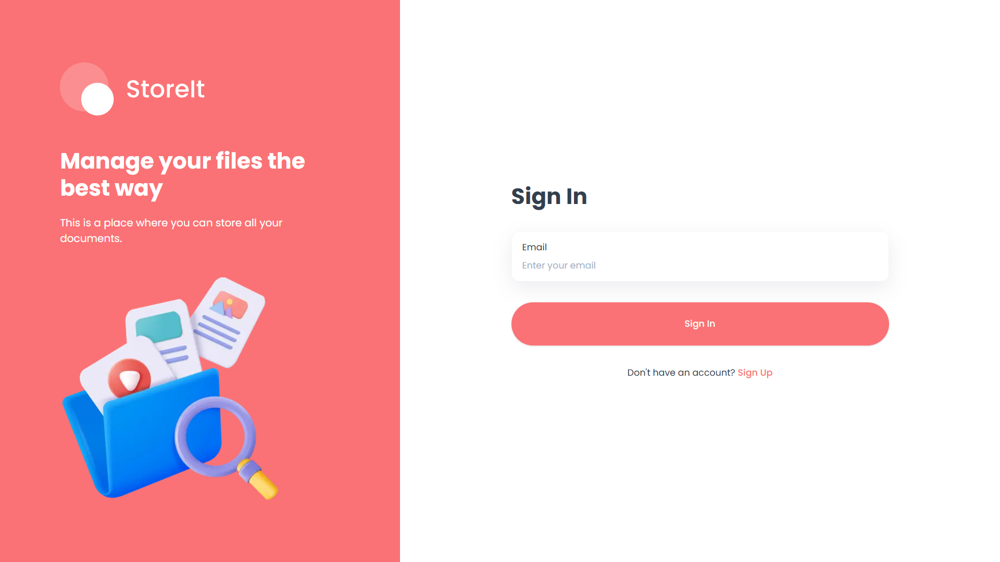
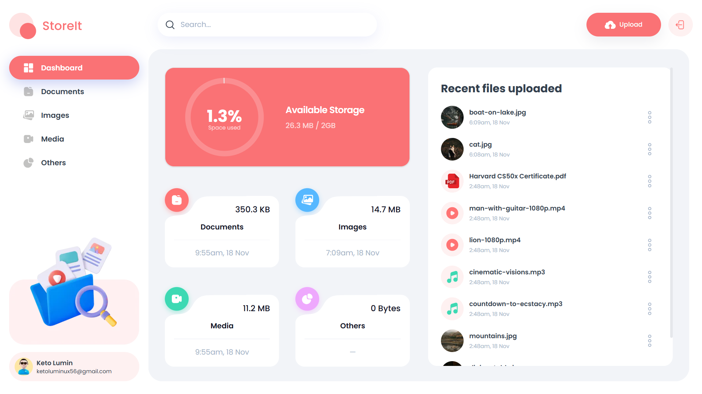

# StoreIt


[](https://store-it-sigma.vercel.app)
[](LICENSE)




## 🌐 Demo

Here is a working live demo: https://store-it-sigma.vercel.app/

## 📝 Description

Welcome to my project! Here, I'll provide you with a brief overview of what inspired me to create it, why it solves a problem, and what I've learned throughout its development.

- **Motivation:** I was motivated to build this project to address the challenge of managing and storing files efficiently. I wanted to enhance my coding skills by working on a real-world application.
- **Why I Built This Project:** My main goal was to create a practical and user-friendly storage solution that allows users to upload, manage, and share their files seamlessly.
- **Problem Solved:** This project aims to simplify file management by providing a centralized platform where users can store various types of files, such as documents, images, and videos, making them easily accessible and shareable.
- **What I Learned:** Throughout the development process, I gained valuable insights into various technologies, including Next.js, Tailwind CSS, and Appwrite. I also improved my understanding of building scalable and maintainable web applications.

## 📖 Table of Contents

- [StoreIt](#storeit)
  - [🌐 Demo](#-demo)
  - [📝 Description](#-description)
  - [📖 Table of Contents](#-table-of-contents)
  - [✨ Features](#-features)
  - [🛠️ Setup Project](#️-setup-project)
    - [🍴 Prerequisites](#-prerequisites)
    - [🚀 Install Project](#-install-project)
  - [🤝 Contributing and Support](#-contributing-and-support)
    - [⚒️ How to Contribute](#️-how-to-contribute)
    - [📩 Bug Report](#-bug-report)
  - [📜 Credits](#-credits)
  - [� Contact Me](#-contact-me)
  - [📋 License](#-license)

## ✨ Features

👉 **User Authentication with Appwrite**: Implement signup, login, and logout functionality using Appwrite's authentication system.

👉 **File Uploads**: Effortlessly upload a variety of file types, including documents, images, videos, and audio, ensuring all your important data.

👉 **View and Manage Files**: Users can browse through their uploaded files stored in Appwrite storage, view on a new tab, rename file or delete.

👉 **File Sharing**: Share files with other users by adding their email addresses, allowing collaborative access.

👉 **Search Functionality**: Quickly find files using the search feature, which supports filtering by file type and name.

👉 **Sort Files**: Sort files by different criteria such as date created, name, and size to easily organize your storage.

👉 **Responsive Design**: Enjoy a seamless experience across all devices with a responsive design that adapts to different screen sizes.

👉 **Dark Mode**: Switch between light and dark themes for a comfortable viewing experience in any lighting condition.

👉 **Usage Summary**: View a summary of your storage usage, including the total space used and the distribution of different file types.

👉 **Real-time Updates**: Get real-time updates on file uploads, deletions, and other actions without needing to refresh the page

## 🛠️ Setup Project

To get this project up and running in your development environment, follow these step-by-step instructions.

### 🍴 Prerequisites

We need to install or make sure that these tools are pre-installed on your machine:

- [NodeJS](https://nodejs.org/en/download/): It is a JavaScript runtime build.
- [Git](https://git-scm.com/downloads): It is an open source version control system.

### 🚀 Install Project

1. Clone the Repository

```bash
git clone https://github.com/janrizmlibres/store-it.git
```

2. Install packages in the project directory

```
npm install
```

3. Create a `.env.local` file in the root directory and add the necessary environment variables

```bash
NEXT_PUBLIC_APPWRITE_ENDPOINT="YOUR_APPWRITE_ENDPOINT"
NEXT_PUBLIC_APPWRITE_PROJECT="YOUR_APPWRITE_PROJECT_ID"
NEXT_PUBLIC_APPWRITE_DATABASE="YOUR_APPWRITE_DATABASE_ID"
NEXT_PUBLIC_APPWRITE_USERS_COLLECTION="YOUR_APPWRITE_USERS_COLLECTION_ID"
NEXT_PUBLIC_APPWRITE_FILES_COLLECTION="YOUR_APPWRITE_FILES_COLLECTION_ID"
NEXT_PUBLIC_APPWRITE_BUCKET="YOUR_APPWRITE_BUCKET_ID"
NEXT_APPWRITE_KEY="YOUR_APPWRITE_SECRET_KEY"
```

4. Run the development server

```bash
npm run dev
```

## 🤝 Contributing and Support

### ⚒️ How to Contribute

Want to contribute? Great!

To fix a bug or enhance an existing module, follow these steps:

- Fork the repo
- Create a new branch (`git checkout -b improve-feature`)
- Make the appropriate changes in the files
- Add changes to reflect the changes made
- Commit your changes (`git commit -am 'Improve feature'`)
- Push to the branch (`git push origin improve-feature`)
- Create a Pull Request

### 📩 Bug Report

If you find a bug (the website couldn't handle the query and / or gave undesired results), kindly open an issue [here](https://github.com/username/projectname/issues/new) by including your search query and the expected result.

## 📜 Credits

I'd like to acknowledge Adrian, who contributed to the success of this project and from whom I utilized certain third-party assets that require attribution. Below is the link to their GitHub profile.

👩 Adrian Hajdin <br>
Email: contact@jsmastery.pro <br>
GitHub: @adrianhajdin

## 📞 Contact Me

[
](https://www.linkedin.com/in/janrizlibres/)

## 📋 License

[MIT](https://choosealicense.com/licenses/mit/)
Released 2024 by Janriz Libres @janrizmlibres
